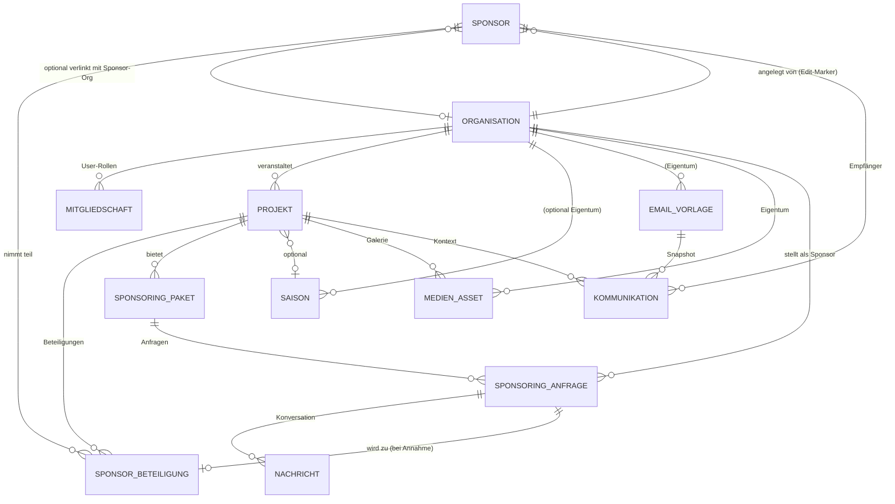

# Sponsoring-Plattform — Konzept v3 (Kollaborative Plattform)

**Version:** 3.0 — **AKTUELL**
**Datum:** 30.04.2026
**Autor:** Fabian Aschwanden
**Codebasis:** `~/Documents/SCA - Sponsoring/Sponsoring-new/sponsoren-app`
**Modell:** Mehrere Vereine, gemeinsame Datenbasis, keine strikte Mandantentrennung

> **Schlüssel-Entscheidung:** Diese Plattform ist **kein Multi-Tenant-SaaS**. Mehrere Vereine arbeiten gemeinsam in einer geteilten Datenbasis. Es gibt **keine Datentrennung zwischen Vereinen** — alle Vereinsmitglieder sehen alle Vereins-, Projekt- und Sponsoren-Daten. Beschränkt werden nur **Edit-Rechte** (ein Vereinsmitglied kann nur seine eigenen Vereins-Daten ändern).
>
> Das ist ein **Community-Modell**, näher an Wikipedia/GitHub-public-orgs als an Salesforce.

---

## Inhaltsverzeichnis

1. [Management Summary](#1-management-summary)
2. [Was die App heute kann (Kurzfassung)](#2-was-die-app-heute-kann-kurzfassung)
3. [Vision & Modell](#3-vision--modell)
4. [Sichtbarkeits- & Berechtigungsmodell](#4-sichtbarkeits--berechtigungsmodell)
5. [Wettbewerbs-Positionierung (Kurzfassung)](#5-wettbewerbs-positionierung-kurzfassung)
6. [Datenmodell-Evolution](#6-datenmodell-evolution)
7. [Architektur-Evolution](#7-architektur-evolution)
8. [Migrations-Strategie (Flyway V8+)](#8-migrations-strategie-flyway-v8)
9. [Funktionale Anforderungen](#9-funktionale-anforderungen)
10. [Roadmap](#10-roadmap)
11. [Risiken & Annahmen](#11-risiken--annahmen)
12. [Offene Entscheidungen](#12-offene-entscheidungen)

---

## 1. Management Summary

Die `sponsoren-app` ist heute eine produktive Single-Org-Anwendung für SCA mit 24 Test-Klassen, OCI-Cloud-Betrieb, OIDC-Auth, Word-Serienbrief, Excel-Im/Export, Diff-Reports und Zefix-Datenbereinigung.

Die Plattform-Erweiterung öffnet sie für **mehrere Vereine** (kollaborativ, ohne Tenant-Walling) und ergänzt einen **öffentlichen Marktplatz**, auf dem Sponsoren Projekte aktiv finden und Anfragen stellen können.

**Kern-Ergänzungen:**

1. **`Organisation`** als Profil-Entity (Verein/Sponsor-Org) — *kein* Tenant-Marker, sondern Eigentumsnachweis für Edit-Rechte.
2. **`Mitgliedschaft`** verbindet Benutzer ↔ Organisation ↔ Rolle — bestimmt, **wer was bearbeiten** darf.
3. **Sponsor-Stammdaten werden geteilt** — alle Vereine sehen alle Sponsoren (Wikipedia-Modell). Notizen, Beteiligungen und Kommunikation bleiben pro Verein zugeordnet, sind aber lesbar.
4. **`SponsoringPaket` & `SponsoringAnfrage`** für strukturierte Pakete und Self-Service-Anfragen.
5. **Public-Marktplatz** für veröffentlichte Projekte (`sichtbarkeit = OEFFENTLICH`).
6. **`MedienAsset`** für Cover-Bilder, Galerien, Pitch-Decks.

**Was diese Vereinfachung bringt:**

- Keine `OrganisationContext`-Komponente, keine Hibernate-Tenant-Filter, kein Org-Switcher — viel weniger Komplexität.
- Keine V9–V11-Backfills mit `NOT NULL`-Constraint-Cascade — Migrationen werden simpel.
- Architektur-Tests entfallen, die "Org A darf Org B nicht lesen" prüfen.
- Onboarding eines neuen Vereins ist trivial: Org-Profil anlegen, fertig.
- Kollaborativer Bonus: Vereine profitieren voneinander (Sponsor-Stammdaten gemeinsam pflegen, Datenqualität durch Crowdsourcing).

**Was wegfällt:**

- Strikte Datenisolation — Vereine sehen sich gegenseitig in die Karten. Das ist eine **bewusste politische Entscheidung** (Community statt Wettbewerb) und muss gegenüber teilnehmenden Vereinen klar kommuniziert werden.

---

## 2. Was die App heute kann (Kurzfassung)

```
       Saison (optional)
         ▲
         │
       Projekt ──< SponsorBeteiligung >── Sponsor
                       │
                       │ erzeugt durch Versand
                       ▼
                  Kommunikation ──> EmailVorlage (optional)
```

**Bestehende Entitäten:** `Sponsor`, `Projekt`, `SponsorBeteiligung`, `Saison`, `EmailVorlage`, `Kommunikation`.
**Stack:** Spring Boot 3.3.4, Java 17+, Thymeleaf+Bootstrap 5, Postgres (prod) / H2 (dev), Flyway V1–V7, OIDC gegen OCI IAM, Apache POI, LibreOffice (DOCX→PDF), Zefix+Nominatim.
**Rollen:** `ROLE_ADMIN`, `ROLE_EDITOR`, `ROLE_VIEWER` (heute global).
**Kernfeatures:** CRUD, Excel-Im/Export, Word-Serienbrief, Serien-E-Mail, Diff-Reports (Projekt/Saison), Datenbereinigung.

Vollständige Bestandsaufnahme im überholten v2-Dokument, Abschnitt 2.

---

## 3. Vision & Modell

### 3.1 Vision

> **„Eine offene Schweizer Plattform, auf der Vereine ihre Sponsoring-Daten gemeinsam pflegen — und Unternehmen Projekte direkt finden und unterstützen können."**

### 3.2 Modell: Kollaborative Plattform

```
┌─────────────────────────────────────────────────────────────────┐
│  ÖFFENTLICHKEIT (anonym)                                        │
│  → sieht: alle veröffentlichten Projekte, Vereinsprofile,       │
│           Sponsoring-Pakete, Sponsoren-Logos                    │
│  → kann: registrieren als Verein oder Sponsor                   │
├─────────────────────────────────────────────────────────────────┤
│  ANGEMELDETE BENUTZER (Mitglied irgendeines Vereins)            │
│  → sieht: ALLE Vereinsdaten, ALLE Sponsoren, ALLE Beteiligungen │
│           ALLE Notizen, ALLE Kommunikationen                    │
│  → editiert: nur Daten der eigenen Vereine (Edit-Rechte)        │
├─────────────────────────────────────────────────────────────────┤
│  PLATTFORM-ADMIN                                                │
│  → verwaltet: Verein-Verifizierung, Moderation, globale Tags    │
└─────────────────────────────────────────────────────────────────┘
```

### 3.3 Was bleibt, was kommt

| Bereich | Bleibt | Kommt neu |
|---|---|---|
| Sponsoren-CRM | komplett | nur `besitzer_organisation_id` als Edit-Marker |
| Projekt | komplett | `sichtbarkeit`, `slug`, `cover_asset_id`, `organisation_id` |
| SponsorBeteiligung | komplett | optional `paket_id` |
| Saison | komplett | `organisation_id` (Edit-Marker) |
| EmailVorlage / Kommunikation | komplett | `organisation_id` (Edit-Marker) |
| Auth | OIDC, 3 Rollen | + `Mitgliedschaft` für Edit-Rechte |
| Public-Marktplatz | — | öffentliche Routen `/marktplatz/**` |
| Sponsoring-Pakete | — | Tabelle + UI |
| Sponsoring-Anfragen | — | Self-Service-Workflow |
| Medien | FileStorage abstrakt | `medien_asset`-Tabelle |

---

## 4. Sichtbarkeits- & Berechtigungsmodell

> **Vollständiges Rollenkonzept** mit Permission-Matrix, konkreten Workflows, Spring-Implementation und DSG-Aspekten: siehe **[`05_Rollenkonzept.md`](05_Rollenkonzept.md)**. Hier nur die Zusammenfassung.

### 4.1 Drei Klassifikationen

| Klasse | Wer sieht? | Wer editiert? | Beispiele |
|---|---|---|---|
| **Public** | jeder (auch anonym) | Mitglieder der Eigentümer-Org | Projekt mit `sichtbarkeit = OEFFENTLICH`, Vereinsprofil, Sponsoring-Pakete |
| **Authenticated** | jeder eingeloggte Benutzer | Mitglieder der Eigentümer-Org | Sponsor-Stammdaten, Beteiligungen, Notizen, Kommunikations-Log |
| **Plattform** | Plattform-Admin | Plattform-Admin | Audit-Events, globale Konfiguration, Verifizierungs-Queue |

### 4.2 Edit-Rechte via Mitgliedschaft

Eine `Mitgliedschaft(user_subject, organisation_id, rolle)` definiert, **welche Datensätze der User bearbeiten darf**.

| Rolle | Rechte (für Daten der zugehörigen Org) |
|---|---|
| `ORG_OWNER` | Alles (inkl. Mitglieder verwalten) |
| `ORG_EDITOR` | CRUD auf Sponsoren, Projekte, Pakete, Anfragen, Kommunikation |
| `ORG_VIEWER` | Nur lesen — kein zusätzlicher Vorteil ggü. anderen authentifizierten Usern |
| `SPONSOR_KONTAKT` | Sponsor-Org-Profil + eigene Anfragen |

Globaler Plattform-Admin (`PLATFORM_ADMIN`) bleibt eine IdP-Gruppe (OIDC).

### 4.3 Implementierungs-Pattern

Jede Mutations-Methode prüft am Anfang:

```java
@PreAuthorize("@accessControl.kannOrgEditieren(#projektOrgId, authentication)")
public Projekt aktualisiere(UUID projektOrgId, ProjektDto dto) { ... }
```

Lese-Methoden brauchen **keinen** zusätzlichen Filter — alle authentifizierten User dürfen alles sehen. Das vereinfacht Repository-Code drastisch (kein `findByOrganisationId(...)` zwingend, klassisches `findAll()` reicht).

### 4.4 Was wir NICHT prüfen

- Keine Tenant-Isolation auf JPA-Ebene (keine Hibernate-Filter).
- Keine `OrganisationContext`-RequestScope-Bean.
- Kein Org-Switcher in der UI (User sieht eh alles).
- Keine "Org A versucht Org B-Daten lesen → muss leer sein"-Architektur-Tests.

---

## 5. Wettbewerbs-Positionierung (Kurzfassung)

Detaillierte Analyse: siehe v1-Konzept (`00_Konzept.md`, weiterhin gültig für Wettbewerber-Profile).

| Plattform | Stärke | Lücke |
|---|---|---|
| Fairgate | Vereins-CRM mit Sponsoring-Modul | Kein Marktplatz, geschlossen |
| fundoo / lokalhelden | Crowdfunding/Spenden | B2B-Sponsoring fehlt |
| MY SPONSOR | Mobile Fan-Spenden | Kein B2B |
| Sponsoo | Sport-Marktplatz Europa | Kein CRM, nur Sport, kein CH-Fokus |
| ClubDesk/campai | Allround-Vereinsverwaltung | Sponsoring nur Nebenfunktion |

**Eigene Position:**

> **„Die Schweizer Open-Sponsoring-Plattform — Vereine pflegen Sponsoren-Daten gemeinsam, und Unternehmen finden Projekte direkt im Marktplatz."**

Differenziert durch: Kollaborations-Ansatz (geteilte Sponsor-Stammdaten = bessere Datenqualität), Branchenoffenheit, projekt-/eventzentrische Sponsoring-Pakete, CH-Fokus mit DSG-Konformität, Re-Use bestehender Tools (Word-Serienbrief, Zefix-Cleanup).

---

## 6. Datenmodell-Evolution

### 6.1 Neue Wurzel-Entität: `Organisation`

**Zweck:** Profil eines Vereins/Sponsor-Unternehmens. Wird zum Eigentumsnachweis für Edit-Rechte und zum Public-Profil im Marktplatz. **Nicht** Tenant-Marker.

| Feld | Typ | Beschreibung |
|---|---|---|
| `id` | UUID PK | |
| `typ` | ENUM | `VEREIN`, `UNTERNEHMEN`, `STIFTUNG`, `ANDERE` |
| `name` | VARCHAR(255) | Anzeigename |
| `slug` | VARCHAR(120) UNIQUE | URL-freundlich (`/marktplatz/organisationen/{slug}`) |
| `rechtsform` | VARCHAR(50) | e.V., AG, GmbH, Verein, Stiftung |
| `branche` | VARCHAR(50) | SPORT, KULTUR, SOZIALES, BILDUNG, UMWELT, WIRTSCHAFT, ANDERE |
| `beschreibung` | TEXT | öffentliche Beschreibung |
| `website_url` | VARCHAR(500) | |
| `logo_asset_id` | UUID FK | → `medien_asset` |
| `status` | ENUM | `PENDING`, `VERIFIED`, `ACTIVE`, `SUSPENDED` |
| `verifiziert_am` | TIMESTAMPTZ | |
| `zefix_uid` | VARCHAR(20) | UID nach Verifizierung |
| `registriert_am` | TIMESTAMPTZ | |
| `created_at`, `updated_at` | Audit | |

### 6.2 Bestehende Entitäten — minimal-invasiv erweitert

Alle bestehenden Tabellen bekommen `besitzer_organisation_id UUID` als Audit-/Edit-Marker. Lese-Filter gibt es **nicht**.

**`Sponsor`** (CRM-Karteikarte, geteilt zwischen allen Vereinen):
- `+ besitzer_organisation_id UUID NULL FK → organisation` (wer hat ihn angelegt)
- `+ organisation_ref_id UUID NULL FK → organisation` (optional: verlinkt auf öffentliche Sponsor-Org)
- alle bestehenden Felder bleiben

> **Politische Entscheidung:** Sponsor-Stammdaten sind plattform-weit geteilt. Wenn Verein A „Migros Genossenschaft" anlegt, sieht Verein B denselben Datensatz. Beide können Beteiligungen erfassen. Edit-Recht hat aber nur derjenige Verein, der den Sponsor angelegt hat (= `besitzer_organisation_id`). Andere Vereine können „Update vorschlagen" (Phase 5).

**`Projekt`**:
- `+ organisation_id UUID NOT NULL FK → organisation` (gehört diesem Verein)
- `+ slug VARCHAR(120) UNIQUE`
- `+ sichtbarkeit ENUM` (`PRIVAT`, `PER_LINK`, `OEFFENTLICH`, `ARCHIVIERT`) — Default `PRIVAT`
- `+ veroeffentlicht_am TIMESTAMPTZ NULL`
- `+ branche VARCHAR(50) NULL` (Filter im Marktplatz)
- `+ erwartete_besucher INTEGER NULL`
- `+ zielgruppe VARCHAR(255) NULL`
- `+ finanzierungsziel_chf NUMERIC(12,2) NULL`
- `+ cover_asset_id UUID NULL FK → medien_asset`
- alle bestehenden Felder bleiben

**`SponsorBeteiligung`**:
- `+ paket_id UUID NULL FK → sponsoring_paket` (optional)

**`Saison`** und **`EmailVorlage`** und **`Kommunikation`**:
- `+ besitzer_organisation_id UUID NULL FK → organisation` (Edit-Marker; bei Saison: NULL = global)

### 6.3 Neue Entitäten

#### `mitgliedschaft`

| Feld | Typ |
|---|---|
| `id` | UUID |
| `user_subject` | VARCHAR(255) (OIDC-Subject oder lokale User-ID) |
| `organisation_id` | UUID FK |
| `rolle` | ENUM (`ORG_OWNER`, `ORG_EDITOR`, `ORG_VIEWER`, `SPONSOR_KONTAKT`) |
| `eingeladen_von` | VARCHAR(255) NULL |
| `created_at` | TIMESTAMPTZ |

UNIQUE `(user_subject, organisation_id, rolle)`.

#### `sponsoring_paket`

| Feld | Typ |
|---|---|
| `id` | UUID |
| `projekt_id` | UUID FK |
| `name` | VARCHAR(100) |
| `stufe` | ENUM (`PLATIN`, `GOLD`, `SILBER`, `BRONZE`, `INDIVIDUELL`) |
| `preis_chf` | NUMERIC(12,2) |
| `beschreibung` | TEXT |
| `leistungen_json` | JSONB |
| `stueckzahl_total` | INTEGER |
| `stueckzahl_vergeben` | INTEGER |
| `sortierung` | SMALLINT |
| `aktiv` | BOOLEAN |

#### `sponsoring_anfrage`

| Feld | Typ |
|---|---|
| `id` | UUID |
| `paket_id` | UUID FK |
| `sponsor_organisation_id` | UUID FK (anfragende Org, typ=UNTERNEHMEN) |
| `absender_user_subject` | VARCHAR(255) |
| `anschreiben` | TEXT |
| `angefragter_betrag_chf` | NUMERIC(12,2) NULL |
| `status` | ENUM (`ENTWURF`, `EINGEREICHT`, `IN_PRUEFUNG`, `ANGENOMMEN`, `ABGELEHNT`, `ZURUECKGEZOGEN`, `ERFUELLT`) |
| `eingereicht_am`, `entschieden_am` | TIMESTAMPTZ |
| `entscheid_notiz` | TEXT |

> Bei `ANGENOMMEN`: automatisch eine `SponsorBeteiligung` im Verein erzeugen.

#### `medien_asset`

| Feld | Typ |
|---|---|
| `id` | UUID |
| `besitzer_organisation_id` | UUID FK |
| `owner_typ` | ENUM (`ORGANISATION`, `PROJEKT`, `SPONSORING_PAKET`) |
| `owner_id` | UUID |
| `medien_typ` | ENUM (`BILD`, `VIDEO`, `DOKUMENT`, `PITCH_DECK`) |
| `mime_type`, `dateigroesse_bytes`, `storage_key`, `original_dateiname` | |
| `breite_px`, `hoehe_px`, `dauer_sek`, `alt_text`, `sortierung` | |
| `created_at`, `created_by` | Audit |

Nutzt das bestehende `FileStorage`-Interface (Local/OCI Object Storage).

#### `nachricht` (Konversation auf Anfragen)

| Feld | Typ |
|---|---|
| `id` | UUID |
| `anfrage_id` | UUID FK |
| `absender_user_subject` | VARCHAR(255) |
| `absender_organisation_id` | UUID FK |
| `body` | TEXT |
| `created_at`, `gelesen_am` | TIMESTAMPTZ |

### 6.4 ER-Diagramm



---

## 7. Architektur-Evolution

### 7.1 Vereinfachte Berechtigungs-Komponente

Eine einzige Spring-Bean `AccessControl`:

```java
@Component("accessControl")
public class AccessControl {

    public boolean kannOrgEditieren(UUID organisationId, Authentication auth) {
        if (auth == null || !auth.isAuthenticated()) return false;
        if (hasGlobalRole(auth, "PLATFORM_ADMIN")) return true;
        return mitgliedschaftRepository.existsByUserSubjectAndOrganisationIdAndRolleIn(
            auth.getName(), organisationId,
            Set.of(Rolle.ORG_OWNER, Rolle.ORG_EDITOR));
    }
}
```

Verwendung in Controllern via `@PreAuthorize("@accessControl.kannOrgEditieren(#orgId, authentication)")`.

### 7.2 Public-Layer (neue Routen, additiv)

| Pfad | Zugang |
|---|---|
| `/marktplatz` | öffentlich (Liste veröffentlichter Projekte) |
| `/marktplatz/projekte/{slug}` | öffentlich |
| `/marktplatz/organisationen/{slug}` | öffentlich |
| `/sitemap.xml` | öffentlich |
| `/sponsor/anfrage/{paketId}` | Login (Sponsor-Rolle) |
| `/admin/verifizierung` | PLATFORM_ADMIN |

Bestehende Routen (`/sponsoren`, `/projekte`, `/saisons`, …) bleiben — Lese-Zugriff für alle authentifizierten User, Edit-Zugriff via `AccessControl`.

### 7.3 Re-Use bestehender Komponenten

| Bestehend | Neue Verwendung |
|---|---|
| `MailService` + `EmailVorlage` | Anfrage-Benachrichtigungen, Sponsor-Onboarding-Mails |
| `FileStorage` (OCI Object Storage) | Backend für `medien_asset` |
| `CleanupOrchestrationService` (Zefix) | Verein-Auto-Verifizierung bei Selbstregistrierung |
| `SerienbriefService` | Vertragsgenerator (Phase 5) |
| `DiffReportService` | bleibt, ggf. Sponsor-übergreifend |

### 7.4 Auth-Strategie

OCI IAM Domains unterstützen Self-Service-Registrierung nur eingeschränkt. Vorschlag:

- **Bestehende SCA-Mitarbeiter:** OIDC gegen OCI IAM (wie heute)
- **Neue Vereins-User & Sponsoren:** Local-Identity-Schema in PostgreSQL, Spring Security Form-Login *zusätzlich* zu OIDC. Dual-Login-Setup.
- Alternative: Externes Keycloak / Auth0 — eine bewusste Entscheidung in Phase 1.

---

## 8. Migrations-Strategie (Flyway V8+)

Bestehende V1–V7 bleiben unverändert. Plattform-Erweiterung als V8–V13.

| Version | Inhalt |
|---|---|
| **V8** | `CREATE TABLE organisation`; SCA als initiale Org (`name='SCA Sponsoring', typ=VEREIN, status=ACTIVE`); `CREATE TABLE mitgliedschaft`; bestehende SCA-OIDC-Subjects als ORG_OWNER seeden |
| **V9** | `ALTER TABLE sponsoren / projekte / saisons / email_vorlagen / kommunikationen ADD COLUMN besitzer_organisation_id UUID NULL`; Backfill mit SCA-Org-ID. Bleibt nullable — keine Cascade-Constraints nötig. |
| **V10** | `CREATE TABLE sponsoring_paket`; SCA-Standardvorlagen (BRONZE/SILBER/GOLD) generieren |
| **V11** | `ALTER TABLE projekte ADD COLUMN slug, sichtbarkeit, veroeffentlicht_am, cover_asset_id, branche, erwartete_besucher, zielgruppe, finanzierungsziel_chf`; Slug aus Name+Datum |
| **V12** | `CREATE TABLE sponsoring_anfrage, nachricht, medien_asset`; Indizes |
| **V13** | `ALTER TABLE sponsor_beteiligungen ADD COLUMN paket_id UUID NULL FK` |

**Backfill-Prinzip:** Nullable-Spalten, gefüllt mit SCA-Org-ID. Kein `NOT NULL`-Cascade, weil Lesefilter ohnehin nicht kommen.

**Im Vergleich zu v2:** Migrationen werden ~50 % einfacher, weil keine harte Tenant-Isolation erforderlich ist.

---

## 9. Funktionale Anforderungen

Priorisierung **M**ust · **S**hould · **C**ould · **W**on't. Status: ✓ vorhanden · ＋ neu · ⊕ erweitern.

### 9.1 Vereins- & Sponsor-Onboarding

| ID | Anforderung | Prio | Status |
|---|---|:---:|:---:|
| ORG-01 | Vereins-Selbstregistrierung mit E-Mail-Verifizierung | M | ＋ |
| ORG-02 | Sponsor-Org-Selbstregistrierung | M | ＋ |
| ORG-03 | Mitglieder einladen mit Rolle | M | ＋ |
| ORG-04 | Plattform-Admin verifiziert manuell | M | ＋ |
| ORG-05 | Auto-Verifizierung via Zefix bei UID-Match | S | ⊕ (Zefix-Client da) |
| ORG-06 | Org-Profil bearbeiten (Logo, Beschreibung, Website) | M | ＋ |

### 9.2 CRM (bestehend)

| ID | Anforderung | Prio | Status |
|---|---|:---:|:---:|
| CRM-01 | Sponsor CRUD (geteilter Datenpool, Edit-Marker) | M | ⊕ |
| CRM-02 | Sponsor-Beteiligung CRUD | M | ⊕ |
| CRM-03 | Excel-Import/Export | M | ✓ |
| CRM-04 | Word-Serienbrief | M | ✓ |
| CRM-05 | Serien-E-Mail mit Vorlagen | M | ✓ |
| CRM-06 | Diff-Reports | M | ✓ |
| CRM-07 | Datenbereinigung (Zefix + Nominatim) | M | ✓ |
| CRM-08 | Verlinkung Sponsor ↔ öffentliche Sponsor-Org | S | ＋ |
| CRM-09 | „Update vorschlagen"-Workflow zwischen Vereinen | C | ＋ |

### 9.3 Projekte & Pakete

| ID | Anforderung | Prio | Status |
|---|---|:---:|:---:|
| PRJ-01 | Projekt CRUD | M | ⊕ |
| PRJ-02 | Sichtbarkeit (Privat/PerLink/Öffentlich/Archiviert) | M | ＋ |
| PRJ-03 | Slug-URL | M | ＋ |
| PRJ-04 | Cover-Bild + Galerie | M | ＋ |
| PRJ-05 | Pitch-Deck-Upload | M | ＋ |
| PRJ-06 | Sponsoring-Paket CRUD | M | ＋ |
| PRJ-07 | Paket-Verfügbarkeit (X/Y vergeben) | M | ＋ |
| PRJ-08 | Beteiligung optional an Paket binden | S | ＋ |
| PRJ-09 | Markdown-Beschreibung | S | ＋ |

### 9.4 Marktplatz & Anfragen

| ID | Anforderung | Prio | Status |
|---|---|:---:|:---:|
| MP-01 | Public-Liste mit Filter (Branche, Region, Datum, Budget) | M | ＋ |
| MP-02 | Public-Detailseite Projekt | M | ＋ |
| MP-03 | Public-Vereinsprofil | M | ＋ |
| MP-04 | Volltextsuche (Postgres `tsvector`) | M | ＋ |
| MP-05 | Sitemap.xml + Schema.org + Open Graph | M | ＋ |
| MP-06 | Anfrage-Form auf Paket-Seite | M | ＋ |
| MP-07 | Anfrage-Workflow + Inbox | M | ＋ |
| MP-08 | Threaded Konversation | M | ＋ |
| MP-09 | E-Mail-Benachrichtigungen | M | ⊕ (MailService) |
| MP-10 | Bei Annahme: SponsorBeteiligung erzeugen | M | ＋ |
| MP-11 | Watchlist (Sponsor folgt Verein) | C | ＋ |
| MP-12 | Matching-Empfehlungen | C | ＋ |

### 9.5 Medien

| ID | Anforderung | Prio | Status |
|---|---|:---:|:---:|
| MED-01 | Bilder (JPG/PNG/WebP) | M | ⊕ (FileStorage) |
| MED-02 | PDFs / Pitch-Decks | M | ⊕ |
| MED-03 | Auto-Thumbnails | S | ＋ |
| MED-04 | Virus-Scan | S | ＋ |

### 9.6 Lokalisierung

| ID | Anforderung | Prio | Status |
|---|---|:---:|:---:|
| L10N-01 | de-CH primär, CHF-Format `1'234.50` | M | ✓ |
| L10N-02 | FR/IT-Übersetzung Public-Layer | S | ＋ |

---

## 10. Roadmap

> Aufwand: Solo-Dev, 50 % Auslastung. TDD-Disziplin (Spec → Test → Impl) bleibt.

### Phase 0 — Organisations-Profil & Mitgliedschaften (2 Wochen)

**Ziel:** Bestehende App bekommt Organisations-Konzept, ohne dass sich für SCA etwas ändert.

- V8: `Organisation` + `Mitgliedschaft` + SCA-Seed
- V9: `besitzer_organisation_id`-Spalten überall (nullable, Backfill auf SCA)
- `AccessControl`-Bean
- `MitgliedschaftService`
- Bestehende `@PreAuthorize`-Annotations werden auf `@accessControl.kannOrgEditieren(...)` umgestellt
- Alle 24 bestehenden Tests bleiben grün

**Erfolgsmetrik:** SCA-Workflow exakt wie heute, ein zweiter Verein kann manuell per SQL angelegt werden und seine Daten bearbeiten.

### Phase 1 — Selbstregistrierung & Org-Profil (2 Wochen)

- Vereins-Registrierungs-Flow (öffentlich)
- E-Mail-Verifizierung
- Org-Profil-Seite (Beschreibung, Logo, Website)
- Manuelle Verifizierung durch Plattform-Admin
- Auto-Verifizierung via Zefix
- Mitglieder einladen

### Phase 2 — Sponsoring-Pakete & Sichtbarkeit (3 Wochen)

- V10+V11: `sponsoring_paket`, Projekt-Felder (Sichtbarkeit, Slug, Cover)
- Paket-CRUD-UI
- Projekt-Wizard mit Pakete-Schritt
- Cover-Bild- & Pitch-Deck-Upload (V12)
- Veröffentlichungs-Flow (`PRIVAT` → `OEFFENTLICH`)

### Phase 3 — Marktplatz Public (3–4 Wochen)

- Public-Routen `/marktplatz/**` + Templates
- Filter & Volltextsuche (Postgres `tsvector`)
- SEO: Slugs, Sitemap, Schema.org, Open Graph
- Public-Vereinsprofile

### Phase 4 — Anfragen & Konversation (3 Wochen)

- V12: `sponsoring_anfrage`, `nachricht`
- Sponsor-Org-Self-Reg
- Anfrage-Form
- Verein-Inbox + Threaded Messages
- E-Mail-Notifications
- Bei Annahme: automatische Beteiligung

### Phase 5 — Wachstum (laufend)

- Watchlist, Matching, Statistiken
- Mehrsprachigkeit FR/IT
- Vertrags-Generator (bestehende Serienbrief-Engine)
- Phase 6: Zahlungs-Integration

### Aufwand

| Phase | Dauer |
|---|---|
| 0 | 2 Wochen |
| 1 | 2 Wochen |
| 2 | 3 Wochen |
| 3 | 3–4 Wochen |
| 4 | 3 Wochen |
| **Gesamt MVP** | **13–14 Wochen** bei Halbtags-Pensum |

> Phase 0 ist gegenüber v2 deutlich kürzer, weil keine Multi-Tenant-Filter-Architektur entsteht.

---

## 11. Risiken & Annahmen

### Risiken

| Risiko | Auswirkung | Maßnahme |
|---|:---:|---|
| Vereine wollen **keine** offene Datenbasis (Konkurrenz-Sorge) | sehr hoch | klare Kommunikation des Modells *vor* Onboarding; ggf. Felder als „intern" markierbar (Phase 5) |
| Sponsor-Stammdaten-Qualität leidet durch viele Bearbeiter | mittel | nur Eigentümer-Org darf editieren; andere können „Update vorschlagen"; Zefix-Cleanup als Wahrheitsquelle |
| DSG-Konformität bei geteilten Sponsoren-Daten | hoch | Datenschutzerklärung + AGB explizit; sensitive Felder (Notizen?) optional org-private |
| Bestehender SCA-Betrieb gestört | hoch | Phase 0 streng additiv; Feature-Flags; Rollback-Skripte |
| Henne-Ei: zu wenige Vereine/Sponsoren | hoch | SCA als Reference-Tenant; Verbands-Partnerschaften vor Launch |
| Auth-Komplexität (OIDC + Self-Reg) | mittel | Phase 1: einfacher Local-Identity-Pfad zusätzlich zu OIDC; oder Keycloak |

### Annahmen

- SCA bleibt aktiver Anwender während der Evolution.
- OCI bleibt Cloud-Plattform.
- Spring Boot bleibt 3.x; Java-Upgrade auf 21 LTS optional in Phase 0.
- Mindestens 5–10 weitere Vereine in Phase 1+2 erreichbar.
- TDD-Workflow bleibt erhalten.
- **Vereine akzeptieren das offene Modell** — wenn nicht, müsste auf v2-Multi-Tenant zurückgegangen werden.

---

## 12. Offene Entscheidungen

1. **Sensitive Felder in Sponsor-Daten:** Sind alle Sponsor-Felder (inkl. Notizen, Bemerkungen, Telefon) tatsächlich öffentlich für alle eingeloggten User? Oder gibt es Felder, die als „intern" markiert werden sollten? → Empfehlung: Phase 0 alles offen; in Phase 5 ggf. `notiz_visibility`-Flag pro Notiz.

2. **OIDC vs. Local Identity:** OCI IAM ist nicht für Self-Reg designed.
   - (a) OCI IAM mit Self-Reg-Flow (umständlich)
   - (b) Lokales User-Schema + Spring Security zusätzlich zu OIDC (Dual-Auth)
   - (c) Externes Keycloak/Auth0 vor OCI

3. **Sponsoren-Org-Verlinkung:** Soll eine Sponsor-Stammdaten-Karteikarte automatisch mit einer öffentlichen Sponsor-Organisation verlinken (per E-Mail-Domain-Match)? → Empfehlung: manuell, mit Vorschlag durch Plattform.

4. **Geschäftsmodell:** Bleibt MVP kostenlos? Provision auf vermittelte Anfragen erst mit Zahlungs-Integration in Phase 5.

5. **Java-21-Migration:** Sinnvoll am Start von Phase 0 (Records, Pattern Matching, Virtual Threads).

6. **Domainname & Branding:** Eigene Domain für Plattform (nicht `sca.ch`), separates Logo & Brand-Identity.

7. **Verein-Verifizierung:** Auto via Zefix (UID-Match) reicht für CH-Vereine? Vereine ohne UID (kleine, nicht eingetragen) → manuelle Prüfung als Fallback.

---

## Datei-Übersicht im Workspace

| Datei | Status |
|---|---|
| **`00_Konzept_v3_Kollaborative-Plattform.md`** ← dieses | **AKTUELL** |
| `00_Konzept_v2_Plattform-Evolution.md` | überholt (Multi-Tenant-Variante) |
| `00_Konzept.md` | überholt (Greenfield-Variante; Wettbewerbsanalyse weiter gültig) |
| `01_Architektur_Konzept.md`, `02_Datenmodell.md`, `03_schema.sql`, `04_Sichtbarkeit_und_Roadmap.md` | überholt (Greenfield) |

**Empfehlung für nächsten Schritt:** Wenn dieses Konzept passt, schreibe ich entweder einen konkreten **Spec-Entwurf für Phase 0** im Stil der bestehenden `specs/`-Dokumente (TDD-konform), oder lege direkt die **Flyway V8-Migration mit ersten JPA-Entity-Erweiterungen** als Code in der `sponsoren-app` an.
