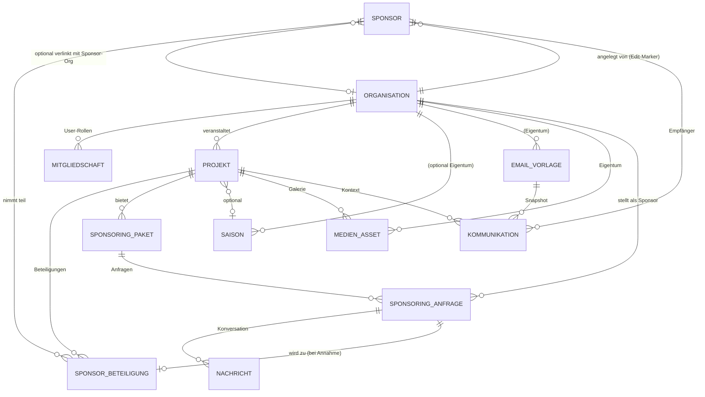

# Sponsoring-Plattform — Konzept v3 (Kollaborative Plattform)

**Version:** 3.3 — **AKTUELL** (Stand der Umsetzung)
**Datum:** 30.04.2026 / Schärfung 05.05.2026 / Umsetzungs-Sync 26.05.2026
**Autor:** Fabian Aschwanden
**Codebasis:** `~/git/sponsorplatz`
**Modell:** Mehrere **Sport- und Health-Vereine**, gemeinsame Datenbasis, keine strikte Mandantentrennung
**Live-Umgebungen:** `sponsorplatz.for-better.biz` (OCI Always-Free) + `sponsorplatz.for-the.biz` (Azure Sweden Central, Warm-DR)

> **Schlüssel-Entscheidung 1 (v3.0):** Diese Plattform ist **kein Multi-Tenant-SaaS**. Mehrere Vereine arbeiten gemeinsam in einer geteilten Datenbasis. Es gibt **keine Datentrennung zwischen Vereinen** — alle Vereinsmitglieder sehen alle Vereins-, Projekt- und Sponsoren-Daten. Beschränkt werden nur **Edit-Rechte** (ein Vereinsmitglied kann nur seine eigenen Vereins-Daten ändern).
>
> Das ist ein **Community-Modell**, näher an Wikipedia/GitHub-public-orgs als an Salesforce.
>
> **Schlüssel-Entscheidung 2 (v3.1, 05.05.2026):** Sponsorplatz ist **strikt auf Sport und Gesundheit** positioniert. Andere Vereinstypen werden bei der Verifizierung abgelehnt. Innerhalb des Health-Fokus ist der Themen-Umfang **breit** (`Branche`-Enum mit elf Werten):
>
> Sport, Bewegung, Reha, Behindertensport, Seniorensport, Prävention, Mental Health, Ernährung, Wellness, Selbsthilfe, Patientenorganisation.
>
> **Schlüssel-Entscheidung 3 (v3.3, 26.05.2026):** Phasen 0–13 sind umgesetzt. Sponsorplatz läuft als eigenständige Greenfield-App (keine Migration aus einer Vorgängeranwendung). Multi-Cloud-Warm-DR mit OCI + Azure ist live. Phase 14 (Produktivschaltung sponsorplatz.ch) ist der letzte Schritt vor dem Pilot.

---

## Inhaltsverzeichnis

1. [Management Summary](#1-management-summary)
2. [Was die App heute kann (Kurzfassung)](#2-was-die-app-heute-kann-kurzfassung)
3. [Vision & Modell](#3-vision--modell)
4. [Sichtbarkeits- & Berechtigungsmodell](#4-sichtbarkeits--berechtigungsmodell)
5. [Wettbewerbs-Positionierung (Kurzfassung)](#5-wettbewerbs-positionierung-kurzfassung)
6. [Datenmodell-Evolution](#6-datenmodell-evolution)
7. [Architektur-Evolution](#7-architektur-evolution)
8. [Migrations-Strategie (Flyway V8+)](#8-migrations-strategie-flyway-v8)
9. [Funktionale Anforderungen](#9-funktionale-anforderungen)
10. [Roadmap](#10-roadmap)
11. [Risiken & Annahmen](#11-risiken--annahmen)
12. [Offene Entscheidungen](#12-offene-entscheidungen)

---

## 1. Management Summary

Sponsorplatz ist eine produktive Greenfield-Plattform für Schweizer **Sport- und Gesundheits-Vereine**, die Sponsoring kollaborativ pflegen und einen öffentlichen Marktplatz nutzen. Stand 26.05.2026: Phasen 0–13 sind umgesetzt, beide Cloud-Zonen (OCI Always-Free + Azure Sweden Central als Warm-DR) sind live, Phase 14 (DNS-Umstellung auf sponsorplatz.ch + Pilot-Welle) ist der letzte Schritt vor dem ersten echten Pilot-Verein.

**Plattform-Bausteine (alle umgesetzt):**

1. **`Organisation`** als Profil-Entity (Verein/Sponsor-Org) — *kein* Tenant-Marker, sondern Eigentumsnachweis für Edit-Rechte.
2. **`Mitgliedschaft`** verbindet Benutzer ↔ Organisation ↔ Rolle — bestimmt, **wer was bearbeiten** darf.
3. **Sponsor-Stammdaten werden geteilt** — alle Vereine sehen alle Sponsoren (Wikipedia-Modell). Notizen, Beteiligungen und Kommunikation bleiben pro Verein zugeordnet, sind aber lesbar.
4. **`SponsoringPaket` & `SponsoringAnfrage`** für strukturierte Pakete und Self-Service-Anfragen mit Threaded-Konversation.
5. **Public-Marktplatz** für veröffentlichte Projekte (`sichtbarkeit = OEFFENTLICH`) mit Postgres-tsvector-Volltextsuche + Filter.
6. **`MedienAsset`** für Cover-Bilder, Galerien, Pitch-Decks (lokales Volume + OCI Object Storage + Azure Blob).
7. **Vertrag + Rechnung + QR-Bill** komplette Abrechnungs-Kette nach Anfrage-Annahme.
8. **Auth + OIDC Multi-Provider** Form-Login + Google/Entra/SwissID/edu-ID, 2FA-TOTP mit Admin-Reset, Domain-Whitelist, RP-initiated Logout.
9. **DSG-Compliance + Backup/Restore** Impressum, Datenschutz, AGB, Audit-Log mit Cloud-Marker, DB + Files-Backup mit Cross-Cloud-Restore.
10. **Multi-Cloud Warm-DR** Azure als zweite Zone, manueller DNS-Switch im Notfall (Slices 5–7 für automatischen Failover noch offen).

**Was diese Vereinfachung bringt:**

- Keine `OrganisationContext`-Komponente, keine Hibernate-Tenant-Filter, kein Org-Switcher — viel weniger Komplexität.
- Keine V9–V11-Backfills mit `NOT NULL`-Constraint-Cascade — Migrationen werden simpel.
- Architektur-Tests entfallen, die "Org A darf Org B nicht lesen" prüfen.
- Onboarding eines neuen Vereins ist trivial: Org-Profil anlegen, fertig.
- Kollaborativer Bonus: Vereine profitieren voneinander (Sponsor-Stammdaten gemeinsam pflegen, Datenqualität durch Crowdsourcing).

**Was wegfällt:**

- Strikte Datenisolation — Vereine sehen sich gegenseitig in die Karten. Das ist eine **bewusste politische Entscheidung** (Community statt Wettbewerb) und muss gegenüber teilnehmenden Vereinen klar kommuniziert werden.

---

## 2. Was die App heute kann (Stand 26.05.2026)

```
       Organisation ──< Mitgliedschaft >── AppUser ──< FederierteIdentitaet >── IdP
            │                                  │
            │                                  │
            ▼                                  ▼
       Projekt ──< SponsoringPaket >── SponsoringAnfrage ──< Nachricht >──
                                              │
                                              ▼ (bei Annahme)
                                          Vertrag ──> Rechnung ──> QR-Bill
            │
            └──< MedienAsset > (Logo, Cover, Galerie, Pitch-Deck)

       AuditLog (umgebung-Marker)   Backup (DB + Files)   Aufgabe
```

**Kern-Entitäten:** `Organisation`, `Mitgliedschaft`, `AppUser`, `FederierteIdentitaet`, `Projekt`, `SponsoringPaket`, `SponsoringAnfrage`, `Nachricht`, `Vertrag`, `Rechnung`, `MedienAsset`, `Watchlist`, `Einladung`, `Benachrichtigung`, `AuditLog`, `Backup`, `Aufgabe`, `PlattformEinstellungen`.

**Stack:**
- **Backend:** Spring Boot 3.5.x, Java 21 LTS, Spring Security 6 (Form-Login + OAuth2-Client), Spring Data JPA, Postgres 17 (prod) / H2 (dev), Flyway V1–V46
- **Frontend:** Thymeleaf (kein SPA), eigenes CSS (Dashboard-Stil), kein Bootstrap (intern bewusste Entscheidung — light footprint)
- **Auth-Providers:** OIDC für Entra ID / Google / SwissID / Switch edu-ID + 2FA-TOTP (`dev.samstevens.totp`)
- **Cloud-Storage:** Local-Volume (dev) / OCI Object Storage (prod) / Azure Blob Storage (DR)
- **Integration:** Zefix-Client (Schweizer UID), `OciStorageService`/`AzureBlobStorageService`, Sentry (Browser + Java), MailService (Mailgun-konfigurierbar)
- **Build/Deploy:** Maven 3.9, Docker multi-stage (`eclipse-temurin:21-jre-jammy`), GitHub Actions CI/CD, Terraform für OCI + Azure, Caddy-Reverse-Proxy mit Let's Encrypt

**Rollen-Modell:**
- **Plattform-Rollen** (`PlatformRolle`): `PLATFORM_ADMIN`, `PLATFORM_MODERATOR`, `PLATFORM_SUPPORT`
- **Org-Rollen** (`Rolle` via `Mitgliedschaft`): `ORG_OWNER`, `ORG_EDITOR`, `ORG_VIEWER`, `SPONSOR_KONTAKT`

**Kernfeatures (live in beiden Cloud-Zonen):**
- Organisationen-CRUD inkl. Org-Hierarchie + Filter (Typ/Status/Branche/Suche)
- Self-Registrierung Verein + Sponsor + Mitglieder-Einladung mit Mail-Verifizierung
- Marktplatz (`/marktplatz`) öffentlich mit tsvector-Suche, Branche-/Region-Filter, SEO (Slug, Sitemap, Schema.org, OG-Tags)
- Sponsoring-Pakete + Anfrage-Workflow mit Threaded-Konversation
- Vertrag-Generator (PDF), Rechnung mit Swiss-QR-Bill, Kündigung
- DSG-konformes Impressum/Datenschutz/AGB, kein Cookie-Banner nötig
- Audit-Log mit `umgebung`-Marker (Cross-Cloud-Sync-Safe), Datenexport pro User
- Backup-System: DB-Dump + Datei-Backup als ZIP, Restore-Pfad via Admin-UI
- 2FA-TOTP optional + Admin-Reset, Backup-Codes (BCrypt-gehashed)
- OIDC-SSO mit Provider-Anzeige in `/admin/benutzer`
- Sentry-Release-Tagging im CD-Workflow (off-by-default ohne DSN)
- A11y-Smoke gegen 10 Routen (public + auth-pflichtig) via Playwright + axe-core

**Test-Disziplin:** ~700 Tests grün, 13 ArchUnit-Regeln (ARCH-01..13) statisch durchgesetzt, TDD-Pflicht in CLAUDE.md verankert.

---

## 3. Vision & Modell

### 3.1 Vision

> **„Eine offene Schweizer Plattform, auf der Vereine ihre Sponsoring-Daten gemeinsam pflegen — und Unternehmen Projekte direkt finden und unterstützen können."**

### 3.2 Modell: Kollaborative Plattform

```
┌─────────────────────────────────────────────────────────────────┐
│  ÖFFENTLICHKEIT (anonym)                                        │
│  → sieht: alle veröffentlichten Projekte, Vereinsprofile,       │
│           Sponsoring-Pakete, Sponsoren-Logos                    │
│  → kann: registrieren als Verein oder Sponsor                   │
├─────────────────────────────────────────────────────────────────┤
│  ANGEMELDETE BENUTZER (Mitglied irgendeines Vereins)            │
│  → sieht: ALLE Vereinsdaten, ALLE Sponsoren, ALLE Beteiligungen │
│           ALLE Notizen, ALLE Kommunikationen                    │
│  → editiert: nur Daten der eigenen Vereine (Edit-Rechte)        │
├─────────────────────────────────────────────────────────────────┤
│  PLATTFORM-ADMIN                                                │
│  → verwaltet: Verein-Verifizierung, Moderation, globale Tags    │
└─────────────────────────────────────────────────────────────────┘
```

### 3.3 Was bleibt, was kommt

| Bereich | Bleibt | Kommt neu |
|---|---|---|
| Sponsoren-CRM | komplett | nur `besitzer_organisation_id` als Edit-Marker |
| Projekt | komplett | `sichtbarkeit`, `slug`, `cover_asset_id`, `organisation_id` |
| SponsorBeteiligung | komplett | optional `paket_id` |
| Saison | komplett | `organisation_id` (Edit-Marker) |
| EmailVorlage / Kommunikation | komplett | `organisation_id` (Edit-Marker) |
| Auth | OIDC, 3 Rollen | + `Mitgliedschaft` für Edit-Rechte |
| Public-Marktplatz | — | öffentliche Routen `/marktplatz/**` |
| Sponsoring-Pakete | — | Tabelle + UI |
| Sponsoring-Anfragen | — | Self-Service-Workflow |
| Medien | FileStorage abstrakt | `medien_asset`-Tabelle |

---

## 4. Sichtbarkeits- & Berechtigungsmodell

> **Vollständiges Rollenkonzept** mit Permission-Matrix, konkreten Workflows, Spring-Implementation und DSG-Aspekten: siehe **[`05_Rollenkonzept.md`](05_Rollenkonzept.md)**. Hier nur die Zusammenfassung.

### 4.1 Drei Klassifikationen

| Klasse | Wer sieht? | Wer editiert? | Beispiele |
|---|---|---|---|
| **Public** | jeder (auch anonym) | Mitglieder der Eigentümer-Org | Projekt mit `sichtbarkeit = OEFFENTLICH`, Vereinsprofil, Sponsoring-Pakete |
| **Authenticated** | jeder eingeloggte Benutzer | Mitglieder der Eigentümer-Org | Sponsor-Stammdaten, Beteiligungen, Notizen, Kommunikations-Log |
| **Plattform** | Plattform-Admin | Plattform-Admin | Audit-Events, globale Konfiguration, Verifizierungs-Queue |

### 4.2 Edit-Rechte via Mitgliedschaft

Eine `Mitgliedschaft(user_subject, organisation_id, rolle)` definiert, **welche Datensätze der User bearbeiten darf**.

| Rolle | Rechte (für Daten der zugehörigen Org) |
|---|---|
| `ORG_OWNER` | Alles (inkl. Mitglieder verwalten) |
| `ORG_EDITOR` | CRUD auf Sponsoren, Projekte, Pakete, Anfragen, Kommunikation |
| `ORG_VIEWER` | Nur lesen — kein zusätzlicher Vorteil ggü. anderen authentifizierten Usern |
| `SPONSOR_KONTAKT` | Sponsor-Org-Profil + eigene Anfragen |

Globaler Plattform-Admin (`PLATFORM_ADMIN`) bleibt eine IdP-Gruppe (OIDC).

### 4.3 Implementierungs-Pattern

Jede Mutations-Methode prüft am Anfang:

```java
@PreAuthorize("@accessControl.kannOrgEditieren(#projektOrgId, authentication)")
public Projekt aktualisiere(UUID projektOrgId, ProjektDto dto) { ... }
```

Lese-Methoden brauchen **keinen** zusätzlichen Filter — alle authentifizierten User dürfen alles sehen. Das vereinfacht Repository-Code drastisch (kein `findByOrganisationId(...)` zwingend, klassisches `findAll()` reicht).

### 4.4 Was wir NICHT prüfen

- Keine Tenant-Isolation auf JPA-Ebene (keine Hibernate-Filter).
- Keine `OrganisationContext`-RequestScope-Bean.
- Kein Org-Switcher in der UI (User sieht eh alles).
- Keine "Org A versucht Org B-Daten lesen → muss leer sein"-Architektur-Tests.

---

## 5. Wettbewerbs-Positionierung (Kurzfassung)

Detaillierte Analyse: siehe v1-Konzept (`00_Konzept.md`, weiterhin gültig für Wettbewerber-Profile).

| Plattform | Stärke | Lücke |
|---|---|---|
| Fairgate | Vereins-CRM mit Sponsoring-Modul | Kein Marktplatz, geschlossen |
| fundoo / lokalhelden | Crowdfunding/Spenden | B2B-Sponsoring fehlt |
| MY SPONSOR | Mobile Fan-Spenden | Kein B2B |
| Sponsoo | Sport-Marktplatz Europa | Kein CRM, nur Sport, kein CH-Fokus |
| ClubDesk/campai | Allround-Vereinsverwaltung | Sponsoring nur Nebenfunktion |

**Eigene Position:**

> **„Die Schweizer Open-Sponsoring-Plattform — Vereine pflegen Sponsoren-Daten gemeinsam, und Unternehmen finden Projekte direkt im Marktplatz."**

Differenziert durch: Kollaborations-Ansatz (geteilte Sponsor-Stammdaten = bessere Datenqualität), Branchenoffenheit, projekt-/eventzentrische Sponsoring-Pakete, CH-Fokus mit DSG-Konformität, Re-Use bestehender Tools (Word-Serienbrief, Zefix-Cleanup).

---

## 6. Datenmodell-Evolution

### 6.1 Neue Wurzel-Entität: `Organisation`

**Zweck:** Profil eines Vereins/Sponsor-Unternehmens. Wird zum Eigentumsnachweis für Edit-Rechte und zum Public-Profil im Marktplatz. **Nicht** Tenant-Marker.

| Feld | Typ | Beschreibung |
|---|---|---|
| `id` | UUID PK | |
| `typ` | ENUM | `VEREIN`, `UNTERNEHMEN`, `STIFTUNG`, `ANDERE` |
| `name` | VARCHAR(255) | Anzeigename |
| `slug` | VARCHAR(120) UNIQUE | URL-freundlich (`/marktplatz/organisationen/{slug}`) |
| `rechtsform` | VARCHAR(50) | e.V., AG, GmbH, Verein, Stiftung |
| `branche` | VARCHAR(50) | SPORT, KULTUR, SOZIALES, BILDUNG, UMWELT, WIRTSCHAFT, ANDERE |
| `beschreibung` | TEXT | öffentliche Beschreibung |
| `website_url` | VARCHAR(500) | |
| `logo_asset_id` | UUID FK | → `medien_asset` |
| `status` | ENUM | `PENDING`, `VERIFIED`, `ACTIVE`, `SUSPENDED` |
| `verifiziert_am` | TIMESTAMPTZ | |
| `zefix_uid` | VARCHAR(20) | UID nach Verifizierung |
| `registriert_am` | TIMESTAMPTZ | |
| `created_at`, `updated_at` | Audit | |

### 6.2 Bestehende Entitäten — minimal-invasiv erweitert

Alle bestehenden Tabellen bekommen `besitzer_organisation_id UUID` als Audit-/Edit-Marker. Lese-Filter gibt es **nicht**.

**`Sponsor`** (CRM-Karteikarte, geteilt zwischen allen Vereinen):
- `+ besitzer_organisation_id UUID NULL FK → organisation` (wer hat ihn angelegt)
- `+ organisation_ref_id UUID NULL FK → organisation` (optional: verlinkt auf öffentliche Sponsor-Org)
- alle bestehenden Felder bleiben

> **Politische Entscheidung:** Sponsor-Stammdaten sind plattform-weit geteilt. Wenn Verein A „Migros Genossenschaft" anlegt, sieht Verein B denselben Datensatz. Beide können Beteiligungen erfassen. Edit-Recht hat aber nur derjenige Verein, der den Sponsor angelegt hat (= `besitzer_organisation_id`). Andere Vereine können „Update vorschlagen" (Phase 5).

**`Projekt`**:
- `+ organisation_id UUID NOT NULL FK → organisation` (gehört diesem Verein)
- `+ slug VARCHAR(120) UNIQUE`
- `+ sichtbarkeit ENUM` (`PRIVAT`, `PER_LINK`, `OEFFENTLICH`, `ARCHIVIERT`) — Default `PRIVAT`
- `+ veroeffentlicht_am TIMESTAMPTZ NULL`
- `+ branche VARCHAR(50) NULL` (Filter im Marktplatz)
- `+ erwartete_besucher INTEGER NULL`
- `+ zielgruppe VARCHAR(255) NULL`
- `+ finanzierungsziel_chf NUMERIC(12,2) NULL`
- `+ cover_asset_id UUID NULL FK → medien_asset`
- alle bestehenden Felder bleiben

**`SponsorBeteiligung`**:
- `+ paket_id UUID NULL FK → sponsoring_paket` (optional)

**`Saison`** und **`EmailVorlage`** und **`Kommunikation`**:
- `+ besitzer_organisation_id UUID NULL FK → organisation` (Edit-Marker; bei Saison: NULL = global)

### 6.3 Neue Entitäten

#### `mitgliedschaft`

| Feld | Typ |
|---|---|
| `id` | UUID |
| `user_subject` | VARCHAR(255) (OIDC-Subject oder lokale User-ID) |
| `organisation_id` | UUID FK |
| `rolle` | ENUM (`ORG_OWNER`, `ORG_EDITOR`, `ORG_VIEWER`, `SPONSOR_KONTAKT`) |
| `eingeladen_von` | VARCHAR(255) NULL |
| `created_at` | TIMESTAMPTZ |

UNIQUE `(user_subject, organisation_id, rolle)`.

#### `sponsoring_paket`

| Feld | Typ |
|---|---|
| `id` | UUID |
| `projekt_id` | UUID FK |
| `name` | VARCHAR(100) |
| `stufe` | ENUM (`PLATIN`, `GOLD`, `SILBER`, `BRONZE`, `INDIVIDUELL`) |
| `preis_chf` | NUMERIC(12,2) |
| `beschreibung` | TEXT |
| `leistungen_json` | JSONB |
| `stueckzahl_total` | INTEGER |
| `stueckzahl_vergeben` | INTEGER |
| `sortierung` | SMALLINT |
| `aktiv` | BOOLEAN |

#### `sponsoring_anfrage`

| Feld | Typ |
|---|---|
| `id` | UUID |
| `paket_id` | UUID FK |
| `sponsor_organisation_id` | UUID FK (anfragende Org, typ=UNTERNEHMEN) |
| `absender_user_subject` | VARCHAR(255) |
| `anschreiben` | TEXT |
| `angefragter_betrag_chf` | NUMERIC(12,2) NULL |
| `status` | ENUM (`ENTWURF`, `EINGEREICHT`, `IN_PRUEFUNG`, `ANGENOMMEN`, `ABGELEHNT`, `ZURUECKGEZOGEN`, `ERFUELLT`) |
| `eingereicht_am`, `entschieden_am` | TIMESTAMPTZ |
| `entscheid_notiz` | TEXT |

> Bei `ANGENOMMEN`: automatisch eine `SponsorBeteiligung` im Verein erzeugen.

#### `medien_asset`

| Feld | Typ |
|---|---|
| `id` | UUID |
| `besitzer_organisation_id` | UUID FK |
| `owner_typ` | ENUM (`ORGANISATION`, `PROJEKT`, `SPONSORING_PAKET`) |
| `owner_id` | UUID |
| `medien_typ` | ENUM (`BILD`, `VIDEO`, `DOKUMENT`, `PITCH_DECK`) |
| `mime_type`, `dateigroesse_bytes`, `storage_key`, `original_dateiname` | |
| `breite_px`, `hoehe_px`, `dauer_sek`, `alt_text`, `sortierung` | |
| `created_at`, `created_by` | Audit |

Nutzt das bestehende `FileStorage`-Interface (Local/OCI Object Storage).

#### `nachricht` (Konversation auf Anfragen)

| Feld | Typ |
|---|---|
| `id` | UUID |
| `anfrage_id` | UUID FK |
| `absender_user_subject` | VARCHAR(255) |
| `absender_organisation_id` | UUID FK |
| `body` | TEXT |
| `created_at`, `gelesen_am` | TIMESTAMPTZ |

### 6.4 ER-Diagramm



---

## 7. Architektur-Evolution

### 7.1 Vereinfachte Berechtigungs-Komponente

Eine einzige Spring-Bean `AccessControl`:

```java
@Component("accessControl")
public class AccessControl {

    public boolean kannOrgEditieren(UUID organisationId, Authentication auth) {
        if (auth == null || !auth.isAuthenticated()) return false;
        if (hasGlobalRole(auth, "PLATFORM_ADMIN")) return true;
        return mitgliedschaftRepository.existsByUserSubjectAndOrganisationIdAndRolleIn(
            auth.getName(), organisationId,
            Set.of(Rolle.ORG_OWNER, Rolle.ORG_EDITOR));
    }
}
```

Verwendung in Controllern via `@PreAuthorize("@accessControl.kannOrgEditieren(#orgId, authentication)")`.

### 7.2 Public-Layer (neue Routen, additiv)

| Pfad | Zugang |
|---|---|
| `/marktplatz` | öffentlich (Liste veröffentlichter Projekte) |
| `/marktplatz/projekte/{slug}` | öffentlich |
| `/marktplatz/organisationen/{slug}` | öffentlich |
| `/sitemap.xml` | öffentlich |
| `/sponsor/anfrage/{paketId}` | Login (Sponsor-Rolle) |
| `/admin/verifizierung` | PLATFORM_ADMIN |

Bestehende Routen (`/sponsoren`, `/projekte`, `/saisons`, …) bleiben — Lese-Zugriff für alle authentifizierten User, Edit-Zugriff via `AccessControl`.

### 7.3 Re-Use bestehender Komponenten

| Bestehend | Neue Verwendung |
|---|---|
| `MailService` + `EmailVorlage` | Anfrage-Benachrichtigungen, Sponsor-Onboarding-Mails |
| `FileStorage` (OCI Object Storage) | Backend für `medien_asset` |
| `CleanupOrchestrationService` (Zefix) | Verein-Auto-Verifizierung bei Selbstregistrierung |
| `SerienbriefService` | Vertragsgenerator (Phase 5) |
| `DiffReportService` | bleibt, ggf. Sponsor-übergreifend |

### 7.4 Auth-Strategie (umgesetzt)

Sponsorplatz hat **zwei Login-Pfade nebeneinander**, beide landen am gleichen `AppUser`:

**Form-Login (Default):**
- E-Mail + Passwort (BCrypt-gehashed), Self-Reg + Mail-Verifizierung
- Optional 2FA-TOTP (Setup unter `/einstellungen/2fa`, 10 Backup-Codes, Admin-Reset via `/admin/benutzer/{id}/2fa-reset`)
- Login-Brute-Force-Schutz: pro E-Mail-Sperre nach N Fehlversuchen, IP-RateLimit zusätzlich

**OIDC-SSO (off-by-default, opt-in pro Provider):**
- Multi-Provider: `IdentityProvider` Enum mit ENTRA_ID, GOOGLE, SWISSID, EDU_ID (V46 droppt die historisch hartcodierte Allowlist — Enum ist alleinige Source of Truth)
- 3-stufige Lookup-Logik in `SponsorplatzOidcUserService`: stabiler `(provider, subject)`-Lookup → Email-Match auf bestehenden AppUser → Just-in-Time-Provisionierung
- Domain-Whitelist (`sponsorplatz.oidc.email-domain-whitelist`) als Account-Takeover-Schutz für Multi-Tenant-IdPs
- Group-Mapping (`sponsorplatz.oidc.rollen-mapping`) — IdP-Group → PlatformRolle, Re-Sync bei jedem Login (entzogene Group entfernt die Rolle)
- RP-initiated Logout via `OidcClientInitiatedLogoutSuccessHandler` mit `{baseUrl}/` als post-logout-redirect
- `nameAttributeKey="email"` damit `authentication.getName()` konsistent die Email zurückgibt
- IdP-Anzeige in `/admin/benutzer`: pro User Chips für die verknüpften Auth-Quellen (Form-Login + Provider-Liste)

**CD-managed Secrets** (idempotent via `/opt/sponsorplatz/.env`-Sync im CD-Workflow):
- `GOOGLE_CLIENT_ID` + `GOOGLE_CLIENT_SECRET` (oder analog für andere Provider)
- `SPONSORPLATZ_API_KEY` für REST-API-Zugriff (off-by-default = 503)
- `SENTRY_DSN`, `SENTRY_RELEASE` für Error-Tracking
- `DB_PASSWORD`, `SMTP_*`, `ADMIN_*` bleiben in der manuell gepflegten VM-`.env` (nicht rotations-getrieben)

Vollständige Spec: [`specs/AUTH_SSO_OIDC.md`](../specs/AUTH_SSO_OIDC.md), [`specs/AUTH_2FA_TOTP.md`](../specs/AUTH_2FA_TOTP.md).

### 7.5 Multi-Cloud Warm-DR (umgesetzt)

Heute laufen zwei unabhängige Cloud-Zonen mit eigener CD-Pipeline:

```
                     GitHub Actions CI
                            │
                ┌───────────┴───────────┐
                ▼                       ▼
         CD Staging-Free            CD Azure-Staging
                │                       │
                ▼                       ▼
       OCI Always-Free-VM      Azure Sweden Central
       (sponsorplatz.            (sponsorplatz.
        for-better.biz)           for-the.biz)
                │                       │
                ▼                       ▼
       Postgres Docker        Postgres Flexible Server
       OCI Object Storage     Azure Blob Storage
```

**Designprinzipien:**
- Beide Zonen sind eigenständig vollständig — kein Shared-Storage, kein Shared-DB
- DR-Modus heute manuell: DB + Files mit `BackupService` von OCI nach Azure restored, DNS-Switch via Cloudflare wäre Notfallhandgriff
- Image-Pipeline: OCI nutzt GHCR (nach OCIR-Block durch Free Tier), Azure nutzt eigenes ACR mit Service-Principal-AcrPush + VM-MSI-AcrPull
- `umgebung`-Marker (Audit-Log + Sentry-Tag) — jedes Ereignis hat seine Cloud-Quelle, damit nach DB-Sync klar bleibt wo's entstand
- Helper-Skript `infra/scripts/patch-vm-compose-envs.sh` synct nachträglich Sentry/Google/API-Key-Env-Refs in laufende VMs (Indent-auto-detect, Backup+Rollback)

**Noch offen** (Phase 15.3 Slices 5–7): automatischer DNS-Failover via Cloudflare, kontinuierliche Cross-Replication, beidseitiger Smoke. Vollständige Architektur-Entscheidung: [`docs/adr/0009-multi-cloud-azure-als-dr-zone.md`](adr/0009-multi-cloud-azure-als-dr-zone.md).

---

## 8. Migrations-Strategie (Flyway V1–V46, alle live)

Sponsorplatz ist eine Greenfield-App, kein Migration-Pfad aus einer Vorgängeranwendung. Die Migrationen sind strikt **additiv** (siehe CLAUDE.md `Migrationen`): neue Spalte → Backfill → alte Spalte droppen erst in nächster V-Nummer.

**Aktuelle Migrations-Landschaft** (Auszug, vollständig in [`src/main/resources/db/migration/`](../src/main/resources/db/migration/)):

| Block | Migrationen | Inhalt |
|---|---|---|
| Foundation | V1–V8 | AppUser, Organisation, Mitgliedschaft, Projekt, SponsoringPaket, SponsoringAnfrage, Watchlist, Einladung |
| Public-Layer | V11, V18, V22 | Slug, Sichtbarkeit, Branche, Markplatz-Felder, tsvector-Volltextsuche (Postgres-only) |
| Auth | V21, V27, V28, V39, V43, V46 | Backlog-Tabelle, OIDC-Backlog-Item, FederierteIdentitaet, 2FA-Backlog, TOTP-Spalten, chk_provider-Drop |
| Anfrage-Lifecycle | V6, V16, V17, V29, V32, V33, V34, V35 | Vertrag, Rechnung, Status-Cleanup, kontakt_anfrage, erstellt_von, wunschbetrag, storno_grund, Kündigung |
| Multi-Cloud | V41, V42 | `audit_log.umgebung`-Spalte + Backfill auf `oci-staging-free` |
| Hygiene | V14, V44, V45 | CHECK-Constraints initial gesetzt + später gedroppt (V44 audit_aktion, V45 benachrichtigung_typ, V46 provider) — Java-Enums sind Source of Truth, doppelte Pflege brittle |
| Misc | V13, V19, V20, V25, V26, V30, V31, V36–V38, V40 | Beteiligung-Paket-Link, Benachrichtigung, Passwort-Reset, sponsor_branche, event, aufgaben, onboarding_gesehen, plattform_aktiver_style, a11y-backlog |

**Lessons learned aus der Umsetzung:**
- **Allowlists droppen** statt synchronisieren: V44/V45/V46 droppen `CHECK (xxx IN (...))`-Constraints, weil die Java-Enums die einzige Source of Truth sind — sonst muss jeder neue Enum-Wert eine neue Migration bekommen.
- **Postgres-only Migrationen** liegen in `db/migration_postgres/` und werden via `spring.flyway.locations` nur in prod/cloud-* geladen (z.B. tsvector). H2 (dev) fällt zur Laufzeit auf LIKE zurück.
- **DDL-auto=validate** in beiden Profilen — Hibernate prüft strikt dass das Schema zur Annotation passt.

---

## 9. Funktionale Anforderungen

Priorisierung **M**ust · **S**hould · **C**ould · **W**on't. Status: ✓ vorhanden · ＋ neu · ⊕ erweitern.

### 9.1 Vereins- & Sponsor-Onboarding

| ID | Anforderung | Prio | Status |
|---|---|:---:|:---:|
| ORG-01 | Vereins-Selbstregistrierung mit E-Mail-Verifizierung | M | ＋ |
| ORG-02 | Sponsor-Org-Selbstregistrierung | M | ＋ |
| ORG-03 | Mitglieder einladen mit Rolle | M | ＋ |
| ORG-04 | Plattform-Admin verifiziert manuell | M | ＋ |
| ORG-05 | Auto-Verifizierung via Zefix bei UID-Match | S | ⊕ (Zefix-Client da) |
| ORG-06 | Org-Profil bearbeiten (Logo, Beschreibung, Website) | M | ＋ |

### 9.2 CRM (bestehend)

| ID | Anforderung | Prio | Status |
|---|---|:---:|:---:|
| CRM-01 | Sponsor CRUD (geteilter Datenpool, Edit-Marker) | M | ⊕ |
| CRM-02 | Sponsor-Beteiligung CRUD | M | ⊕ |
| CRM-03 | Excel-Import/Export | M | ✓ |
| CRM-04 | Word-Serienbrief | M | ✓ |
| CRM-05 | Serien-E-Mail mit Vorlagen | M | ✓ |
| CRM-06 | Diff-Reports | M | ✓ |
| CRM-07 | Datenbereinigung (Zefix + Nominatim) | M | ✓ |
| CRM-08 | Verlinkung Sponsor ↔ öffentliche Sponsor-Org | S | ＋ |
| CRM-09 | „Update vorschlagen"-Workflow zwischen Vereinen | C | ＋ |

### 9.3 Projekte & Pakete

| ID | Anforderung | Prio | Status |
|---|---|:---:|:---:|
| PRJ-01 | Projekt CRUD | M | ⊕ |
| PRJ-02 | Sichtbarkeit (Privat/PerLink/Öffentlich/Archiviert) | M | ＋ |
| PRJ-03 | Slug-URL | M | ＋ |
| PRJ-04 | Cover-Bild + Galerie | M | ＋ |
| PRJ-05 | Pitch-Deck-Upload | M | ＋ |
| PRJ-06 | Sponsoring-Paket CRUD | M | ＋ |
| PRJ-07 | Paket-Verfügbarkeit (X/Y vergeben) | M | ＋ |
| PRJ-08 | Beteiligung optional an Paket binden | S | ＋ |
| PRJ-09 | Markdown-Beschreibung | S | ＋ |

### 9.4 Marktplatz & Anfragen

| ID | Anforderung | Prio | Status |
|---|---|:---:|:---:|
| MP-01 | Public-Liste mit Filter (Branche, Region, Datum, Budget) | M | ＋ |
| MP-02 | Public-Detailseite Projekt | M | ＋ |
| MP-03 | Public-Vereinsprofil | M | ＋ |
| MP-04 | Volltextsuche (Postgres `tsvector`) | M | ＋ |
| MP-05 | Sitemap.xml + Schema.org + Open Graph | M | ＋ |
| MP-06 | Anfrage-Form auf Paket-Seite | M | ＋ |
| MP-07 | Anfrage-Workflow + Inbox | M | ＋ |
| MP-08 | Threaded Konversation | M | ＋ |
| MP-09 | E-Mail-Benachrichtigungen | M | ⊕ (MailService) |
| MP-10 | Bei Annahme: SponsorBeteiligung erzeugen | M | ＋ |
| MP-11 | Watchlist (Sponsor folgt Verein) | C | ＋ |
| MP-12 | Matching-Empfehlungen | C | ＋ |

### 9.5 Medien

| ID | Anforderung | Prio | Status |
|---|---|:---:|:---:|
| MED-01 | Bilder (JPG/PNG/WebP) | M | ⊕ (FileStorage) |
| MED-02 | PDFs / Pitch-Decks | M | ⊕ |
| MED-03 | Auto-Thumbnails | S | ＋ |
| MED-04 | Virus-Scan | S | ＋ |

### 9.6 Lokalisierung

| ID | Anforderung | Prio | Status |
|---|---|:---:|:---:|
| L10N-01 | de-CH primär, CHF-Format `1'234.50` | M | ✓ |
| L10N-02 | FR/IT-Übersetzung Public-Layer | S | ＋ |

---

## 10. Roadmap

> Detaillierte Plan- und Spec-Sicht: [`specs/ROADMAP.md`](../specs/ROADMAP.md). Hier nur die kuratierte Konzept-Sicht mit Status.

### Phasen 0–9 ✅ — Foundation + CRM + Marktplatz + Anfrage-Lifecycle

Komplett umgesetzt. Sponsorplatz hat den Funktionsumfang den der ursprüngliche v3-Plan als "MVP" definiert hat, **plus** Vertrag/Rechnung/QR-Bill, Aufgaben-Engine, Plattform-Einstellungen.

- Organisations-Profil + Mitgliedschaften + AccessControl
- Self-Reg + Mail-Verifizierung + Mitglieder-Einladung
- Sponsoring-Pakete + Sichtbarkeit + Cover/Pitch-Deck-Upload
- Marktplatz public (`/marktplatz`) mit tsvector-Volltextsuche, SEO (Slug/Sitemap/Schema.org/OG)
- Anfrage-Workflow mit Threaded Messages + Mail-Notifications
- Vertrag-Generator (PDF) + Rechnung mit Swiss-QR-Bill + Kündigung
- Mehrsprachigkeit (de-CH/en/fr-CH/it-CH) im Public-Layer

### Phase 10 — Production-Readiness ✅ (10.1–10.3, 10.5)

- 10.1 Monitoring (TraceId-Filter, Actuator-Probes)
- 10.2 Error-Tracking (Sentry Java + Browser, DSG-konform, SRI-Pinning)
- 10.3 DSG-Compliance + Public-Pages (Impressum, Datenschutz, AGB)
- 10.5 Security-Hardening (CSP, Permissions-Policy, Referrer-Policy)
- ~~10.4~~ → in Phase 14 verschoben (HTTPS/SMTP-prod/DNS)

### Phasen 11 + 12 ✅ — Backup/Restore + Ops-Dashboard + Alerts

- BackupService (DB + Files-ZIP) mit provider-agnostischem Upload
- Admin-UI `/admin/backups` + `/admin/datei-backups` mit Restore-Pfad
- Ops-Dashboard (RecentErrors, OpsAlertJob, System-Snapshot)

### Phase 13 — Pre-Pilot-Hardening ✅

- **13.1 A11y-Smoke für authentifizierte Seiten** — Playwright + axe-core auf 10 Routen, WCAG-AA-Fixes
- **13.2 2FA-TOTP** (Slice A+B + Admin-Reset live; PLATFORM_ADMIN-Pflicht bewusst zurückgestellt bis erste echte Admins kommen)
- **13.3 OIDC** (Multi-Provider, Domain-Whitelist, RP-Logout — vollständig CD-managed)

### Phase 14 — Produktivschaltung sponsorplatz.ch 🔜 (anstehend)

- 14.1 Infrastruktur — HTTPS via Let's Encrypt, prod-SMTP statt MailHog, SPF/DKIM/DMARC, DNS sponsorplatz.ch + IPv6
- 14.2 Cutover-Validation ✅ — CD-Smoke (`/login`-200-Probe), Sentry-Release-Tagging, Rollback-Pfad in Infra-READMEs
- 14.3 Pilot-Welle — 5 echte CH-Sport-/Health-Vereine + 3 Sponsoren onboarden

### Phase 15 — Post-Pilot Wachstum (teilweise schon umgesetzt)

- 15.1 echte Zahlungs-Provider-Integration: 📋 geplant
- 15.2 Mahnwesen: 📋 geplant
- 15.3 **Multi-Cloud Azure** — Slices 1–4 ✅ (App + Terraform + CD live), Slices 5–7 offen (DNS-Failover, Cross-Replication, beidseitiger Smoke)
- 15.4 **Datei-Backup + Restore** ✅ ZIP-basiert, provider-agnostisch
- **`umgebung`-Marker** ✅ Cross-Cloud-Sync-Schutz im Audit-Log + Sentry-Tag

### Aufwand-Retrospektive

| Phase | Plan v3 (April 2026) | Ist (Mai 2026) |
|---|---|---|
| MVP (0–4 entspr. v3-Plan) | 13–14 Wochen | umgesetzt |
| 5/9 (Wachstum-Themen) | "laufend" | Vertrag/Rechnung/QR-Bill + Aufgaben + Mehrsprachigkeit ⊕ vorgezogen |
| 10–13 (Ops + Hardening) | nicht im v3-Plan | ergänzt, getrieben durch DR + DSG-Anforderungen |
| 14 (Pilot-Launch) | "Phase 6" | wartet auf DNS+SMTP-Setup |
| 15 (DR + Mahnwesen + Payment) | "Phase 5+6" | DR ⊕ vorgezogen, Mahnwesen/Payment open |

---

## 11. Risiken & Annahmen

### Aktuelle Risiken (Stand 26.05.2026)

| Risiko | Auswirkung | Maßnahme |
|---|:---:|---|
| Vereine akzeptieren das offene Modell nicht | sehr hoch | im Pilot validieren (Phase 14.3); Notausgang: in v3 wurden bewusst keine Multi-Tenant-Filter eingebaut, ein Rückzug wäre teuer |
| Sponsor-Stammdaten-Qualität leidet durch viele Bearbeiter | mittel | nur Eigentümer-Org darf editieren; Zefix-Cleanup als Wahrheitsquelle; "Update vorschlagen" als Backlog |
| DSG-Konformität bei geteilten Sponsoren-Daten | hoch | DSG-Pages (Impressum/Datenschutz/AGB) ✅, Audit-Log mit Datenexport pro User ✅, Sentry ohne PII ✅ |
| Henne-Ei: zu wenige Vereine/Sponsoren beim Launch | hoch | Pilot-Welle 1 mit 5 ausgewählten Vereinen, Sponsor-Wave folgt |
| OIDC-IdP-Konfigurationsfehler beim Provider-Kunden | mittel | Multi-Provider-Setup mit Domain-Whitelist + JIT-Provisioning + Account-Takeover-Schutz |
| Cloud-Single-Point-of-Failure (OCI-VM) | mittel | Warm-DR via Azure-Zone live, DNS-Failover manuell (automatisiert in 15.3) |
| GitHub-Actions-Outage blockt CD | niedrig | manueller Deploy via `IMAGE_URL`-Pin in `.env` + `force-recreate` dokumentiert (Rollback-Pfad) |

### Annahmen

- Spring Boot bleibt 3.5.x; Java 21 LTS ist gesetzt.
- OCI Always-Free + Azure als Warm-DR — kostenlos im Pilot.
- TDD + ArchUnit-Pflicht bleiben — keine Architektur-Entscheidung ohne Test.
- **Vereine akzeptieren das offene Modell** — wird im Pilot validiert (Phase 14.3).

---

## 12. Bisherige Entscheidungen + offene Fragen

### Geklärt (in der Umsetzung entschieden)

1. **OIDC vs. Local Identity:** beides — Form-Login als Default + OIDC Multi-Provider als opt-in. Keine Auth0/Keycloak-Komplexität dazwischen.
2. **Java-21-Migration:** früh durchgezogen, alle Module nutzen Records + Pattern Matching.
3. **Domainname & Branding:** sponsorplatz.ch (Pilot-Aliases: `*.for-better.biz` / `*.for-the.biz`), eigene Brand-Identity (`/`-Hero), CSS-Theme dashboard-orientiert ohne Bootstrap.
4. **Verein-Verifizierung:** Zefix-Auto-Check + manueller Fallback durch Plattform-Admin — beide live.
5. **Branchen-Fokus:** strikt Sport/Gesundheit (`Branche`-Enum hartcodiert), andere Typen werden bei der Verifizierung abgelehnt.
6. **Multi-Cloud:** Azure als zweite Zone — Warm-DR, kein Active-Active. ADR-0009 dokumentiert die Entscheidung.

### Noch offen

1. **Sensitive Felder in Sponsor-Daten:** aktuell alles offen für eingeloggte User. Wenn Pilot-Feedback "zu offen" sagt → `notiz_visibility`-Flag pro Notiz (kleiner Backlog-Slice).
2. **Sponsoren-Org-Verlinkung:** automatisch per E-Mail-Domain-Match oder manuell? Heute manuell, kein dringender Bedarf.
3. **Geschäftsmodell:** MVP/Pilot kostenlos, Provisions-Modell erst nach Zahlungs-Provider-Integration (Phase 15.1).
4. **DR-Aktivierung:** ab wann automatischer DNS-Failover (Cloudflare-Health-Check) statt manueller Switch? Heute reicht der manuelle Pfad für die Pilot-Phase.
5. **PLATFORM_ADMIN-2FA-Pflicht:** erzwungen sobald erste echte Admin-Accounts angelegt werden (out of pilot, in 13.2 Slice C Teil 2 dokumentiert).

---

## Wo finde ich was

Das Konzept ist eine kuratierte Zusammenfassung. Maßgeblich für Umsetzung + Entscheidungen sind die folgenden Dokumente im Repo:

**Konzept-Dokumente** (`docs/`):
| Datei | Inhalt |
|---|---|
| **`konzept.md`** ← dieses | High-Level-Konzept + Roadmap-Übersicht |
| `roadmap-detailliert.md` | Ausführliche Roadmap (Aufwandsabschätzungen, Diskussionen) |
| `naming.md` | Begründung der Markennamen-Entscheidung |
| `marketing.md` | Marketing-Strategie für den Pilot-Launch |
| `architektur/` | C4-Diagramme als Structurizr-DSL + Auto-Render |
| `adr/` | Architecture Decision Records (numeriert, ADR-0009 = Multi-Cloud) |
| `a11y-bekannt.md` | A11y-Baseline-Findings, die der Smoke nicht als Failure zählt |

**Specs** (`specs/`, **maßgeblich für Code-Disziplin**):
| Datei | Inhalt |
|---|---|
| `ROADMAP.md` | aktiv gepflegte Phase-/Slice-Sicht mit Status |
| `TECHNISCHE_SPEZIFIKATION.md` | Stack-Details + Routen |
| `DATENMODELL.md` | Schema + Beziehungen |
| `ROLLENKONZEPT.md` | Berechtigungs-Matrix |
| `TESTSTRATEGIE.md` | Test-IDs (`ORG-*`, `SSO-*`, `A11Y-*`, …) als Referenzschlüssel zwischen Spec + Code |
| `AUTH_SSO_OIDC.md` | OIDC-Spec mit allen Lookup-Stufen + Mitigations |
| `AUTH_2FA_TOTP.md` | 2FA-Spec mit Backup-Codes + Admin-Reset |

**Code-Dokumentation** (Root):
| Datei | Inhalt |
|---|---|
| `CLAUDE.md` | Maßgeblich für KI-Assistenten + neue Devs: Stack, Phasen-Status, TDD-Pflicht, ARCH-Regeln |
| `.instructions.md` | Clean-Code-Konventionen (deutsche Domain-Sprache, Guard-Clauses, View-DTO-Pflicht) |
| `infra/README.md` | Infrastruktur-Übersicht (OCI + Azure) |
| `infra/staging-free/README.md` | OCI-Setup, REST-API-Aktivierung, Google-OIDC-Aktivierung, Rollback-Pfad |
| `infra/envs/azure-staging/README.md` | Azure-Setup, Querverweis auf OCI für gemeinsame Operationen |

**Historisch** (nicht mehr maßgeblich, nur als Begründung der Entscheidungen):
- `00_Konzept.md` (Greenfield-Variante), `00_Konzept_v2_*` (Multi-Tenant-Variante) — beide überholt, v3 (dieses Dokument) hat gewonnen.

---

**Stand:** Phase 13 ist durch, Phase 14 (Produktivschaltung) anstehend. Pilot kann starten sobald DNS + prod-SMTP konfiguriert sind.
