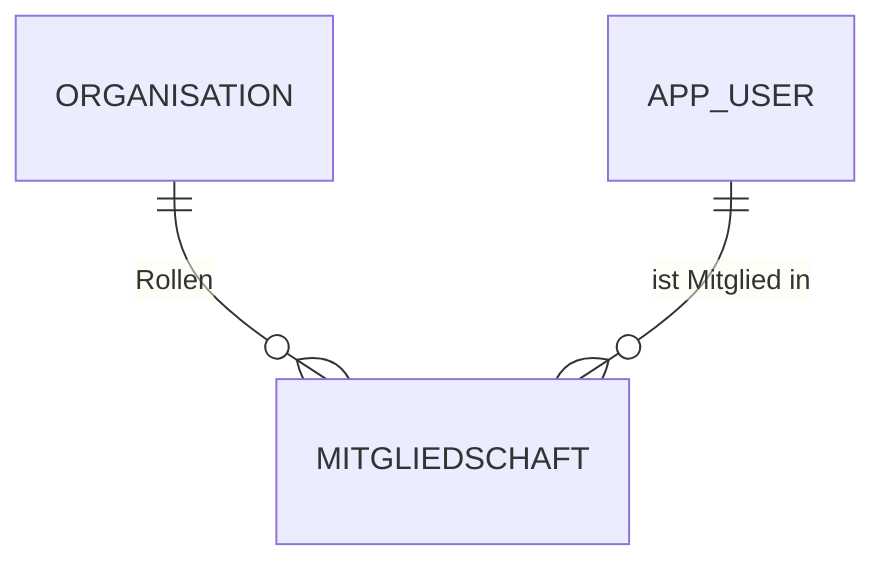

# Datenmodell

## Phase 0 — Baseline

Aktuell: **leere Schema-Baseline** (V1__init.sql), nur Marker-Tabelle.

Echte Tabellen kommen ab V2 schrittweise.

## Geplante Entitäten

### Phase 0.1 — Organisation & Mitgliedschaft

**`organisation`**

| Feld | Typ |
|---|---|
| id | UUID PK |
| typ | ENUM (VEREIN, UNTERNEHMEN, STIFTUNG, ANDERE) |
| name | VARCHAR(255) |
| slug | VARCHAR(120) UNIQUE |
| rechtsform | VARCHAR(50) |
| branche | VARCHAR(50) |
| beschreibung | TEXT |
| website_url | VARCHAR(500) |
| status | ENUM (PENDING, VERIFIED, ACTIVE, SUSPENDED) |
| zefix_uid | VARCHAR(20) |
| created_at, updated_at | TIMESTAMPTZ |

**`app_user`**

| Feld | Typ |
|---|---|
| id | UUID PK |
| email | CITEXT UNIQUE |
| password_hash | VARCHAR(255) |
| vollname | VARCHAR(255) |
| email_verifiziert_am | TIMESTAMPTZ |
| ist_aktiv | BOOLEAN |
| created_at | TIMESTAMPTZ |

**`mitgliedschaft`**

| Feld | Typ |
|---|---|
| id | UUID PK |
| user_id | UUID FK → app_user |
| organisation_id | UUID FK → organisation |
| rolle | ENUM (ORG_OWNER, ORG_EDITOR, ORG_VIEWER) |
| eingeladen_von | UUID NULL |
| created_at | TIMESTAMPTZ |

UNIQUE `(user_id, organisation_id, rolle)`.

### Phase 0.2 — CRM

`sponsor`, `kontaktperson`, `sponsor_beteiligung`, `projekt`, `saison` — basierend auf bewährtem Modell aus der `sponsoren-app`, hier als Plattform mit `besitzer_organisation_id` als Edit-Marker.

### Phase 2 — Sponsoring-Pakete

`sponsoring_paket` mit `projekt_id`, `name`, `stufe`, `preis_chf`, `leistungen_json`, `stueckzahl_total`, `stueckzahl_vergeben`.

### Phase 4 — Anfragen & Kommunikation

`sponsoring_anfrage`, `nachricht`.

## Migrations-Strategie

Versionierte Flyway-Migrationen unter `src/main/resources/db/migration/V*.sql`:

- V1 — Baseline (leer)
- V2 — Organisation + Mitgliedschaft (Phase 0.1)
- V3 — App User + Verifizierungs-Tokens (Phase 1.1)
- V4 — Sponsor + Projekt + Beteiligung (Phase 0.2)
- ... (siehe ROADMAP.md)

Jede Migration:
1. Hinzufügen, niemals destruktiv ändern
2. Bei Spalten-Umbenennung: neue Spalte + Backfill + alte droppen in nächster Version
3. Vor Deployment auf prod immer im Staging gegen Prod-Schnappschuss testen
